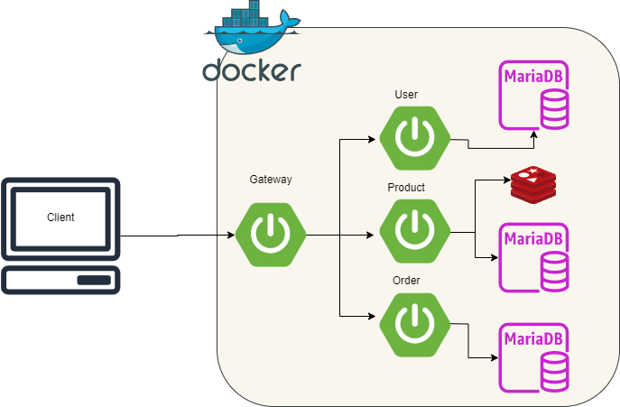

<a name="readme-top"></a>
# 🌟 프로젝트 개요
- 동시성 솔루션이 포함된 MSA 쇼핑몰 API
- 2024.04 ~ 2024.05

<p align="right">(<a href="#readme-top">back to top</a>)</p>

# 🧰 사용 기술
* Java 21
* Spring boot 3.2.5
* Maria DB
* Redis

<p align="right">(<a href="#readme-top">back to top</a>)</p>

# ✨ 주요 기능
**API 명세**  
- [User](https://dehkartes.github.io/swagger-ui/?urls.primaryName=PreorderUser)
- [Product](https://dehkartes.github.io/swagger-ui/?urls.primaryName=PreorderProduct)
- [Order](https://dehkartes.github.io/swagger-ui/?urls.primaryName=PreorderOrder) 

**데이터 관리**
- 사용자, 제품, 주문 CRUD

**동시성 솔루션**
- Redisson Distributon Lock을 사용한 동기 재고 연산
- Redis를 사용한 Look Aside + Write Back 재고 캐싱

<p align="right">(<a href="#readme-top">back to top</a>)</p>

# 📜 아키텍쳐


<p align="right">(<a href="#readme-top">back to top</a>)</p>

# 📥 설치 및 실행

- Docker 
	```bash
	docker compose -f "docker-compose.yml" up -d --build
	```

<p align="right">(<a href="#readme-top">back to top</a>)</p>