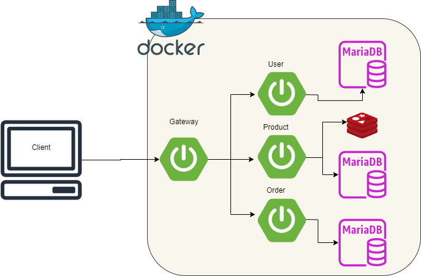

<a name="readme-top"></a>
# 🌟 프로젝트 개요
- 동시성 솔루션이 포함된 MSA 쇼핑몰 API
- 2024.04 ~ 2024.05

MSA, 동시성 문제, 대규모 트래픽 대응을 학습하기 위해 쇼핑몰 백엔드 API를 구현하였습니다.

Troubleshooting:

- **MSA를 통한 Scale out 비용 최적화 및 시스템 확장성 향상**
    
    문제:
    
    Monolithic 구조에서 scale out이 진행되면 트래픽이 집중되지 않는 영역까지 확장되는 비효율 발생
    
    해결:
    
    도메인별로 모듈을 나누어 트래픽이 집중되는 모듈만 확장되도록 구성
    
    Gradle로 서브 모듈을 관리하고, Docker로 모듈 패키징 및 컨테이너 관리
    
    WebClient 서브 모듈 통신으로 모듈 간 안정적인 데이터 교환
    
- **Redisson Distribution Lock을 사용한 멀티 프로세스 환경에서의 동시성 문제 해결**
    
    문제:
    
    재고 예약구매에 동시에 트래픽이 집중되면 공유자원(재고량)에 동시에 접근하게 되어 데이터 정합성 손실됨
    
    Scale out을 상정한 멀티 프로세스 환경에 대한 동시성 솔루션 필요
    
    해결:
    
    Redisson Distribution Lock으로 각 프로세스의 쓰레드들이 Redis 서버와 통신하여 중앙 집중형 Lock 정보를 기반으로 Lock을 획득하거나 반납하는 방식 적용
    
- **Caching으로 재고량 연산 속도 개선(JMeter 부하테스트 분당 2,300개 → 4,200개)**
    
    문제:
    
    Distribution Lock 적용으로 트래픽이 집중되는 상황에서 병목 현상 발생으로 인한 성능 저하
    
    해결:
    
    상품의 재고량을 Redis에 Aside + Write Back 캐싱하여 읽기/쓰기 속도 개선

<p align="right">(<a href="#readme-top">back to top</a>)</p>

# 🧰 주요 기술
- Java 21
- Spring boot 3.2.5
- JPA
- Graddle
- Maria DB
- Redis
- Docker / Docker Compose

<p align="right">(<a href="#readme-top">back to top</a>)</p>

# ✨ 주요 기능
**API 명세**  
- [User](https://dehkartes.github.io/swagger-ui/?urls.primaryName=PreorderUser)
- [Product](https://dehkartes.github.io/swagger-ui/?urls.primaryName=PreorderProduct)
- [Order](https://dehkartes.github.io/swagger-ui/?urls.primaryName=PreorderOrder) 

**데이터 관리**
- 사용자, 제품, 주문 CRUD

**동시성 솔루션**
- Redisson Distributon Lock을 사용한 동기 재고 연산
- Redis를 사용한 Look Aside + Write Back 재고 캐싱

<p align="right">(<a href="#readme-top">back to top</a>)</p>

# 📜 아키텍쳐


<p align="right">(<a href="#readme-top">back to top</a>)</p>

# 📥 설치 및 실행

- Docker 
	```bash
	docker compose -f "docker-compose.yml" up -d --build
	```

<p align="right">(<a href="#readme-top">back to top</a>)</p>
